# Visual Flow Diagram: Competitive Intelligence Pipeline
## From "Warby Parker" to Actionable Intelligence Reports

---

## 🎯 Pipeline Overview Diagram

```mermaid
graph TD
    A[👤 INPUT: Warby Parker + Eyewear] --> B[🔍 Stage 1: Discovery Engine]
    B --> C[🤖 Stage 2: AI Curation]
    C --> D[📱 Stage 3: Meta Ads Collection]
    D --> E[🔧 Stage 4: Data Enrichment]
    E --> F[📊 Stage 5: Temporal Intelligence]
    F --> G[🧠 Stage 6: Strategic Analysis]
    G --> H[⚡ Stage 7: Intervention Planning]
    H --> I[🎯 Stage 8: Whitespace Detection]
    I --> J[💻 Stage 9: SQL Generation]
    J --> K[📋 Stage 10: Report Assembly]

    K --> L[📄 JSON Reports]
    K --> M[📊 SQL Dashboards]
    K --> N[📈 Executive Reports]

    style A fill:#e1f5fe
    style L fill:#c8e6c9
    style M fill:#c8e6c9
    style N fill:#c8e6c9
```



---

## 🔄 Data Transformation Flow


---

## 📊 L1→L4 Intelligence Framework

```mermaid
pyramid
    title L1→L4 Progressive Disclosure Framework

    L1 : Executive Intelligence
    L1 : 5 Critical Insights
    L1 : Threat Assessment
    L1 : Confidence: 82%

    L2 : Strategic Intelligence
    L2 : 6 Analysis Modules
    L2 : Temporal Trends
    L2 : Competitive Positioning

    L3 : Tactical Intelligence
    L3 : 16 Interventions
    L3 : Implementation Timeline
    L3 : Budget: $470K

    L4 : Operational Intelligence
    L4 : SQL Dashboards
    L4 : ML Forecasting
    L4 : Automated Monitoring
```

---

## 🎯 Intelligence Modules Execution


---

## 🚀 Execution Timeline Visualization

```mermaid
gantt
    title Competitive Intelligence Pipeline Execution
    dateFormat X
    axisFormat %s

    section Discovery
    Web Search (12 queries)    :0, 30s
    Competitor Scoring         :30s, 45s

    section Validation
    AI Model Consensus         :45s, 75s
    Quality Filtering          :75s, 90s

    section Collection
    Meta Ads API Calls         :90s, 180s
    Data Validation            :180s, 210s

    section Intelligence
    6 Module Analysis          :210s, 360s
    Temporal Processing        :360s, 420s

    section Output
    Report Generation          :420s, 480s
    SQL Dashboard Creation     :480s, 540s

    section Total Pipeline     :active, 0, 540s
```

---

## 📈 Data Volume Flow

```mermaid
sankey
    title Data Processing Volume

    "Web Sources" --> "400+ Candidates" : 400
    "400+ Candidates" --> "5 Validated" : 5
    "5 Validated" --> "1,247 Ads" : 1247
    "1,247 Ads" --> "6 Modules" : 1247
    "6 Modules" --> "16 Interventions" : 16
    "6 Modules" --> "7 Opportunities" : 7
    "6 Modules" --> "10 SQL Files" : 10
```

---

## 🎯 Output Artifacts Map


---

## 🔍 Technology Stack Architecture


---

## 📊 Report Generation Flow


---

## 🎯 Business Impact Visualization

