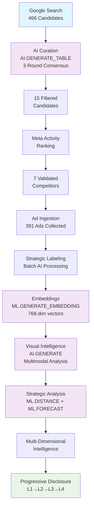
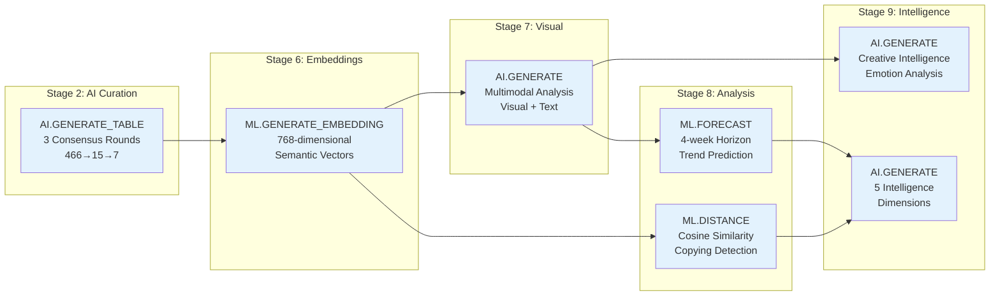
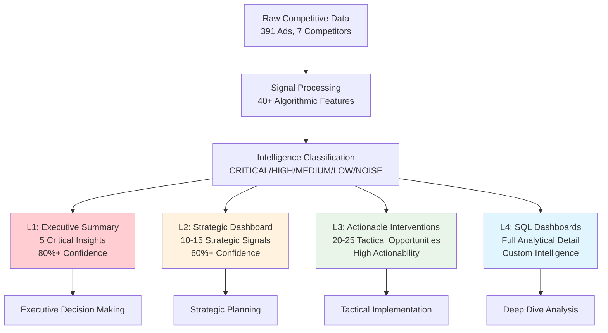
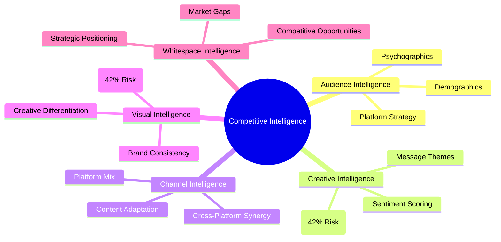
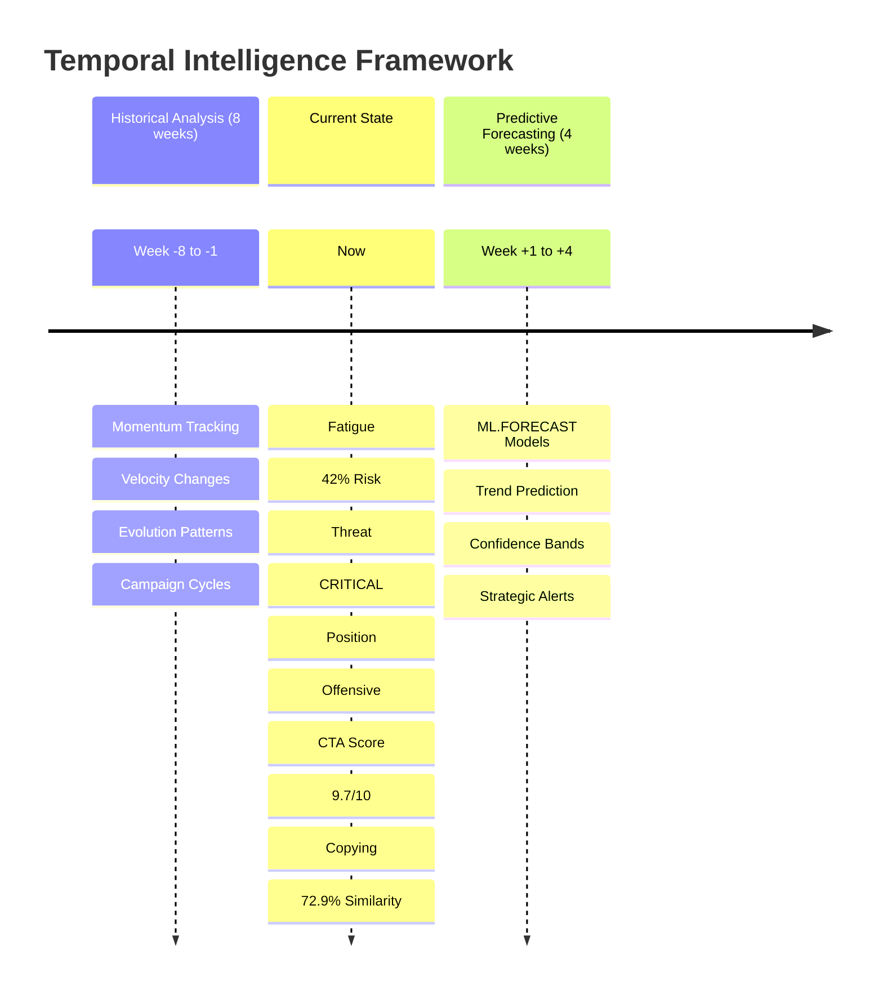
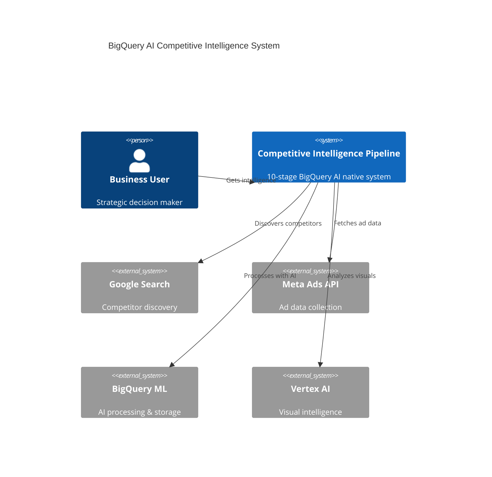
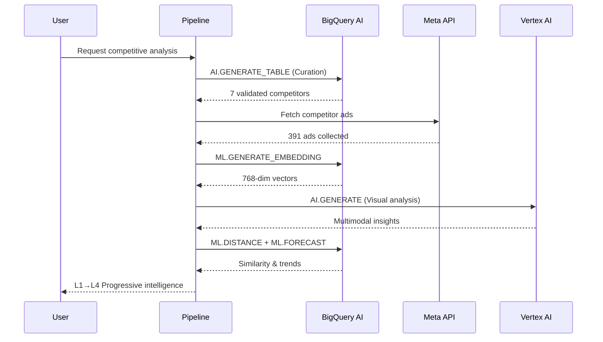

# Pipeline Mermaid Diagrams

## 1. Data Flow & Pipeline Overview

## 2. BigQuery AI Primitives Flow

## 3. Progressive Disclosure Hierarchy

## 4. Multi-Dimensional Intelligence Architecture

## 5. Temporal Intelligence Timeline

## 6. System Architecture Overview

## 7. Real-time Processing Flow

## Usage Benefits

### **Mermaid Advantages over ASCII:**
- **Professional Rendering**: Clean, publication-ready diagrams
- **GitHub Integration**: Native rendering in GitHub/GitLab
- **Interactive Elements**: Clickable nodes and hover effects
- **Export Options**: SVG/PNG export for presentations
- **Responsive Design**: Scales well across devices

### **Best Use Cases:**
- **Technical Documentation**: GitHub README files
- **Presentation Materials**: Export to slides
- **Interactive Demos**: Live rendering in web interfaces
- **Competition Submission**: Professional visual appeal

### **Combination Strategy:**
- **ASCII diagrams**: Always work, great for terminals/text-only environments
- **Mermaid diagrams**: Enhanced visual appeal for web/presentation contexts
- Use both to maximize compatibility and impact