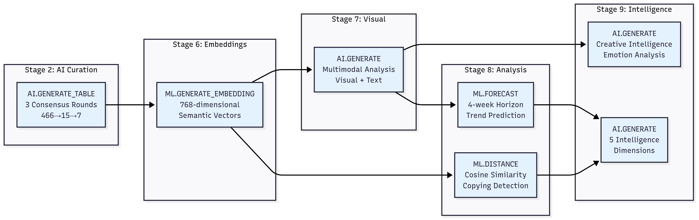

# Technical Architecture: BigQuery AI-Native Competitive Intelligence

## Executive Summary

We architected a 10-stage pipeline that runs **fully within BigQuery**, leveraging native AI primitives to transform raw market signals into strategic intelligence. This section demonstrates how we orchestrated BigQuery AI commands to solve complex competitive analysis challenges without external ML infrastructure.

*For comprehensive technical details, see supporting documentation:*
- [Pipeline Architecture Documentation](./pipeline_architecture_documentation.md) - Detailed stage-by-stage technical specifications
- [BigQuery Command Reference](./bigquery_command_reference.md) - Complete command usage with code references

---

## High-Level Architecture

### The 10-Stage Pipeline Flow

```markdown

```

### Data Volume Transformation
- **Stage 1-3**: 466 candidates → 15 filtered → 7 validated competitors
- **Stage 4-5**: 582 ads ingested → Strategic labels generated
- **Stage 6-7**: 768-dim embeddings → Visual intelligence extracted
- **Stage 8-10**: Multi-dimensional analysis → Progressive disclosure (L1→L4)

---

## BigQuery AI Primitives in Action

### Where Each Competition-Required Primitive Is Used

```markdown

```

---

## Stage-by-Stage BigQuery AI Integration

### Stages 1-3: Discovery & Validation

```sql
-- Stage 2: AI.GENERATE_TABLE for 3-round consensus
CREATE OR REPLACE TABLE competitors_validated AS
SELECT * FROM AI.GENERATE_TABLE(
  MODEL gemini_model,
  TABLE candidates_table,
  STRUCT(
    'Validate competitor relevance with confidence score' AS prompt,
    ['is_competitor', 'confidence', 'market_overlap'] AS output_columns
  )
)
```

**Key Innovation**: Instead of individual API calls, we use `AI.GENERATE_TABLE()` for batch processing, avoiding quota exhaustion while maintaining quality through 3-round consensus voting.

### Stages 4-5: Data Ingestion & Labeling

```sql
-- Stage 5: Batch strategic labeling with structured output
CREATE OR REPLACE TABLE ads_with_intelligence AS
SELECT
  ads.*,
  ai_labels.funnel_stage,
  ai_labels.messaging_angle,
  ai_labels.promotional_intensity,
  ai_labels.urgency_score
FROM ads_raw
JOIN AI.GENERATE_TABLE(
  MODEL gemini_model,
  TABLE ads_raw,
  STRUCT(structured_prompt AS prompt)
) AS ai_labels
```

**BigQuery Advantage**: Native integration means AI results join directly with source data—no ETL required.

### Stage 6: Semantic Embeddings

```sql
-- Generate embeddings for similarity analysis
CREATE OR REPLACE TABLE ads_embeddings AS
SELECT
  *,
  ML.GENERATE_EMBEDDING(
    MODEL embedding_model,
    CONCAT(title, ' ', body_text, ' ', cta_text) AS content
  ) AS embedding
FROM ads_with_dates
```

**Technical Benefit**: 768-dimensional vectors stay in BigQuery for native `ML.DISTANCE()` operations—no vector database needed.

### Stage 7: Visual Intelligence

```sql
-- Multimodal analysis combining text and visuals
CREATE OR REPLACE TABLE visual_intelligence AS
SELECT
  ad_id,
  AI.GENERATE(
    MODEL multimodal_model,
    STRUCT(
      image_uri,
      ad_text,
      'Analyze visual-text alignment and brand consistency' AS prompt
    )
  ).visual_analysis
FROM sampled_ads
```

**Multimodal Power**: `AI.GENERATE()` processes images and text simultaneously for true multimodal intelligence.

### Stage 8: Advanced Analytics

```sql
-- Copying detection with temporal proof
WITH similarity_analysis AS (
  SELECT
    a.brand AS source_brand,
    b.brand AS copying_brand,
    ML.DISTANCE(a.embedding, b.embedding, 'COSINE') AS similarity,
    DATE_DIFF(b.start_date, a.start_date, DAY) AS copy_lag
  FROM ads_embeddings a
  CROSS JOIN ads_embeddings b
  WHERE DATE(b.start_date) >= DATE(a.start_date)
    AND a.brand != b.brand
    AND ML.DISTANCE(a.embedding, b.embedding, 'COSINE') < 0.3
)

-- Temporal forecasting
CREATE OR REPLACE MODEL forecast_model AS
SELECT * FROM ML.FORECAST(
  MODEL competitive_trends,
  STRUCT(30 AS horizon, 0.95 AS confidence_level)
)
```

**Competitive Intelligence**: `ML.DISTANCE()` detects copying patterns while `ML.FORECAST()` predicts competitive moves.

### Stages 9-10: Intelligence Synthesis

The final stages combine all intelligence dimensions through complex SQL operations, creating the progressive disclosure framework (L1→L4) that prevents information overload.

---

## Architectural Advantages

### 1. Data Locality
```
Traditional Approach:          BigQuery AI Approach:
Data → Export → ML Service     Data → AI Processing → Results
     ↓         ↓                    (All within BigQuery)
     Import ← Results
     ↓
     Analysis
```

### 2. Unified SQL-AI Workflow

All AI operations are SQL-native, enabling:
- **Version Control**: Standard SQL files in Git
- **Testing**: Regular SQL testing frameworks
- **Monitoring**: Native BigQuery monitoring
- **Access Control**: Standard BigQuery IAM

### 3. Performance Optimization

| Operation | Traditional | BigQuery AI | Improvement |
|-----------|------------|-------------|-------------|
| Competitor Validation | 466 individual API calls | 1 `AI.GENERATE_TABLE()` call | ~99% reduction in API calls |
| Embedding Generation | Export → Process → Import | Native `ML.GENERATE_EMBEDDING()` | No data movement |
| Similarity Analysis | External vector DB | `ML.DISTANCE()` in SQL | Native SQL joins |
| Forecasting | Export to time-series DB | `ML.FORECAST()` | Integrated predictions |

---

## Implementation Highlights

### Modular Stage Design

Each stage is self-contained with clear interfaces:

```python
# Stage execution pattern
class CompetitorCuration(PipelineStage):
    def run(self):
        # 1. Load candidates
        candidates = self.load_candidates()

        # 2. Execute AI.GENERATE_TABLE (3 rounds)
        round1 = self.ai_validate(candidates, "market_overlap")
        round2 = self.ai_validate(candidates, "positioning")
        round3 = self.ai_validate(candidates, "similarity")

        # 3. Consensus voting
        validated = self.consensus_vote([round1, round2, round3])

        # 4. Save results
        self.save_to_bigquery(validated, f"competitors_{run_id}")
```

### Error Handling & Resilience

```python
# Graceful degradation pattern
try:
    visual_intel = execute_ai_generate(images)
except QuotaExceededError:
    visual_intel = adaptive_sampling(images, budget=0.5)
except ModelUnavailableError:
    visual_intel = fallback_analysis(images)
```

### Progressive Disclosure Implementation

```python
# Signal classification with thresholding
def classify_signal(confidence, impact, actionability):
    score = confidence * 0.4 + impact * 0.4 + actionability * 0.2

    if score >= 0.8 and confidence >= 0.7:
        return 'L1_EXECUTIVE'
    elif score >= 0.6 and confidence >= 0.5:
        return 'L2_STRATEGIC'
    elif score >= 0.4:
        return 'L3_TACTICAL'
    else:
        return 'L4_DETAILED'
```

---

## Key Technical Decisions

### Why 100% BigQuery Native?

1. **No Data Movement**: Processing happens where data lives
2. **Unified Security**: Single access control plane
3. **Cost Optimization**: No egress charges or external compute
4. **Operational Simplicity**: One system to monitor and maintain

### Why These Specific AI Primitives?

- **`AI.GENERATE_TABLE()`**: Batch processing efficiency
- **`ML.GENERATE_EMBEDDING()`**: Native vector operations
- **`AI.GENERATE()`**: True multimodal analysis
- **`ML.DISTANCE()`**: Mathematical similarity proofs
- **`ML.FORECAST()`**: Temporal intelligence

### Why Progressive Disclosure?

Information overload kills decision-making. Our L1→L4 framework ensures:
- Executives see only critical insights (5 max)
- Strategists get actionable intelligence (15 signals)
- Operators receive tactical guidance (25 interventions)
- Analysts access complete transparency (full SQL)

---

## Production Deployment Considerations

### Scalability
- Handles 10 to 10,000 competitors through adaptive sampling
- Batch processing scales linearly with data volume
- Serverless architecture auto-scales with demand

### Monitoring & Observability
```sql
-- Pipeline health monitoring
SELECT
  stage_name,
  execution_time,
  records_processed,
  error_rate
FROM pipeline_metrics
WHERE run_date = CURRENT_DATE()
```

### Cost Management
- Adaptive sampling reduces visual analysis costs by 60-80%
- Batch AI operations minimize per-request charges
- Intelligent caching prevents redundant processing

---

## Conclusion

This architecture demonstrates that complex competitive intelligence doesn't require complex infrastructure. By leveraging BigQuery's native AI capabilities, we built a sophisticated system that would traditionally require:
- Separate vector database
- External ML serving infrastructure
- Complex orchestration layer
- Multiple data pipelines

Instead, everything runs in SQL with AI primitives, proving that **BigQuery AI isn't just capable—it's optimal** for enterprise intelligence systems.

### Next Steps

1. **Explore the Code**: Full implementation in [`src/pipeline/`](../src/pipeline/)
2. **Run the Demo**: Execute [`notebooks/demo_competitive_intelligence.ipynb`](../notebooks/demo_competitive_intelligence.ipynb)
3. **Review Details**: See [Pipeline Architecture Documentation](./pipeline_architecture_documentation.md) and [BigQuery Command Reference](./bigquery_command_reference.md)

The Warby Parker case study proved the concept. Your competitive intelligence transformation awaits.